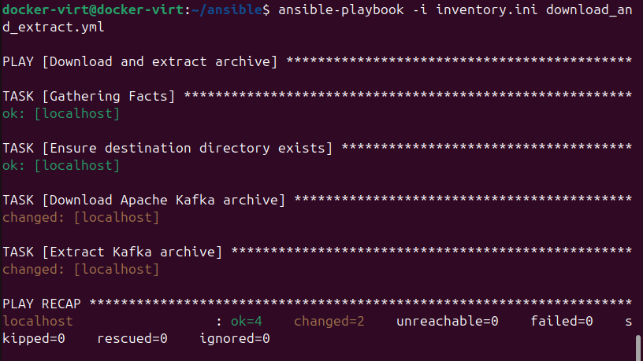
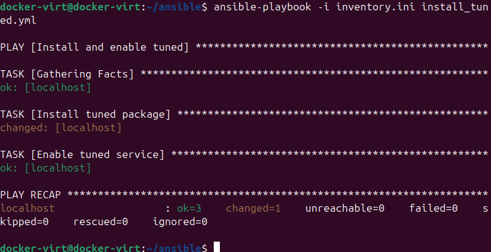
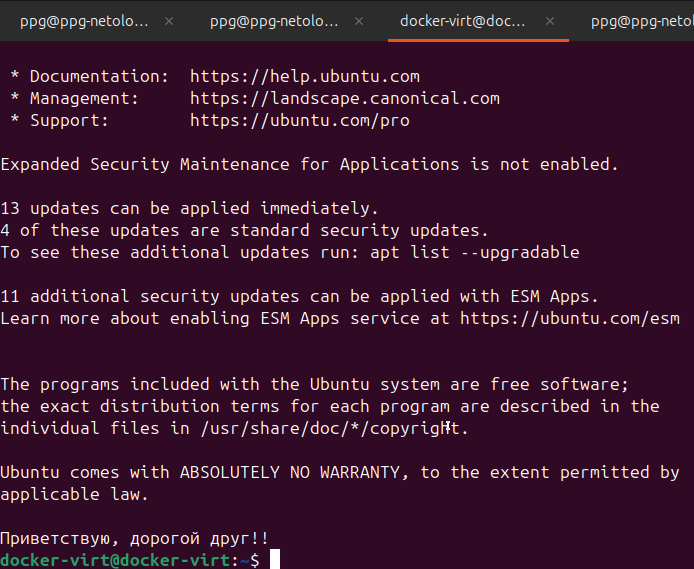
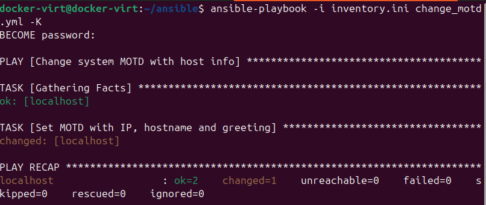
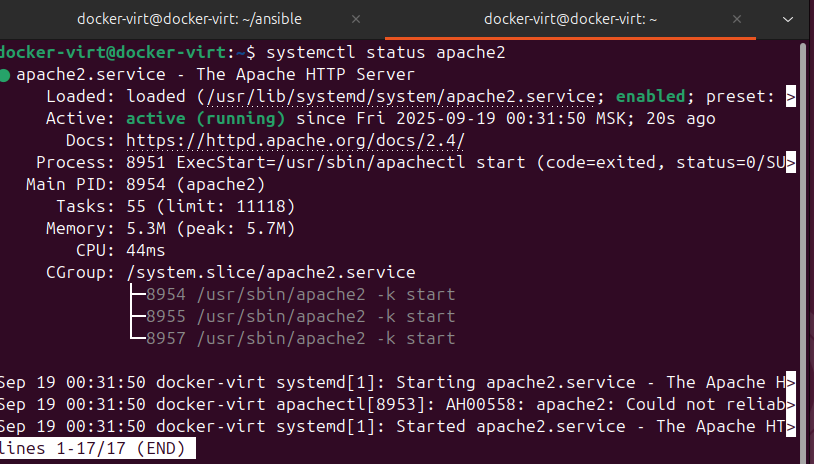
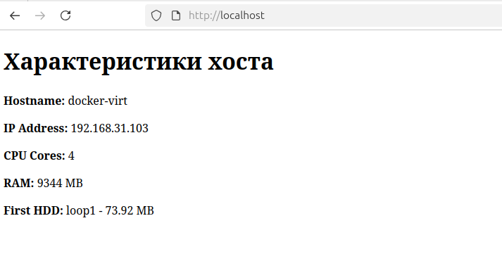

# Домашнее задание к занятию "«Ansible. Часть 2»" - Петров Петр
### Задание 1
Выполните действия, приложите файлы с плейбуками и вывод выполнения.
Напишите три плейбука. При написании рекомендуем использовать текстовый редактор с подсветкой синтаксиса YAML.

Плейбуки должны:
1. Скачать какой-либо архив, создать папку для распаковки и распаковать скаченный архив. Например, можете использовать официальный сайт и зеркало Apache Kafka. При этом можно скачать как исходный код, так и бинарные файлы, запакованные в архив — в нашем задании не принципиально.
2. Установить пакет tuned из стандартного репозитория вашей ОС. Запустить его, как демон — конфигурационный файл systemd появится автоматически при установке. Добавить tuned в автозагрузку.
3. Изменить приветствие системы (motd) при входе на любое другое. Пожалуйста, в этом задании используйте переменную для задания приветствия. Переменную можно задавать любым удобным способом.

### Решение 1
1. [Первый плейбук](playbooks/download_and_extract.yml)

Результат выполнения плейбука:

2. [Второй плейбук](playbooks/install_tuned.yml)

Результат выполнения плейбука:
Установка и запуск tuned:

tuned запущен:

Проверка автоматического запуска при загрузке системы:

3. [Третий плейбук](playbooks/change_motd.yml)

Третий плейбук запущен

Результат работы третьего плейбука:

### Задание 2
Выполните действия, приложите файлы с модифицированным плейбуком и вывод выполнения.

Модифицируйте плейбук из пункта 3, задания 1. В качестве приветствия он должен установить IP-адрес и hostname управляемого хоста, пожелание хорошего дня системному администратору.

### Решение 2
[Модифицированный плейбук из задания 1.3](playbooks/change2_motd.yml)

Плейбук запущен:
 

Результат работы плейбука:
 

### Задание 3

#### Выполните действия, приложите архив с ролью и вывод выполнения.

Ознакомьтесь со статьёй «Ansible - это вам не bash», сделайте соответствующие выводы и не используйте модули shell или command при выполнении задания.

Создайте плейбук, который будет включать в себя одну, созданную вами роль. Роль должна:

1. Установить веб-сервер Apache на управляемые хосты.
2. Сконфигурировать файл index.html c выводом характеристик каждого компьютера как веб-страницу по умолчанию для Apache. Необходимо включить CPU, RAM, величину первого HDD, IP-адрес. Используйте Ansible facts и jinja2-template. Необходимо реализовать handler: перезапуск Apache только в случае изменения файла конфигурации Apache.
3. Открыть порт 80, если необходимо, запустить сервер и добавить его в автозагрузку.
4. Сделать проверку доступности веб-сайта (ответ 200, модуль uri).
В качестве решения:

- предоставьте плейбук, использующий роль;
- разместите архив созданной роли у себя на Google диске и приложите ссылку на роль в своём решении;
- предоставьте скриншоты выполнения плейбука;
- предоставьте скриншот браузера, отображающего сконфигурированный index.html в качестве сайта.

### Решение 3
[Плейбук использующий роль](playbooks/site.yml)

[Ссылка на архив созданной роли](https://drive.google.com/file/d/1P3Is-vzcq2ZOUrJE1ez1fs3--ZWZVysJ/view?usp=sharing)

Скриншот выполнения плейбука:

Cкриншот браузера, отображающего сконфигурированный index.html в качестве сайта:

